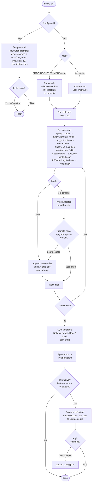

# brag-doc-prep

Captures professional accomplishments to a personal brag doc — runs daily via cron or on-demand for any timeframe.

## How it works

## Trigger phrases

- "set up daily brag tracking"
- "update brag doc for last week"
- "I shipped X today, log it"
- "what did I accomplish this quarter"
- "back-fill the last two weeks"

## What it produces

A folder (default `~/Documents/brag-doc/`) containing:

- `brag-doc.md` — the canonical record, append-only on cron runs.
- `brag-doc-adhoc-<gen-date>-<timeframe-slug>.md` — scratchpad artifacts for ad-hoc queries (perf review prep, "last 2 weeks", etc.).
- `config.json` — your decisions from the setup wizard.
- `.brag-log.jsonl` — one record per run for audit + resume.
- `cron.log` — cron stdout/stderr (if cron is enabled).

## Files in this skill

- [SKILL.md](SKILL.md) — the skill itself (loaded by Claude when activated).
- [REFERENCE.md](REFERENCE.md) — supplementary notes: headless/cron setup, source-specific inference hints, schema reference, companion-skill placeholders.
